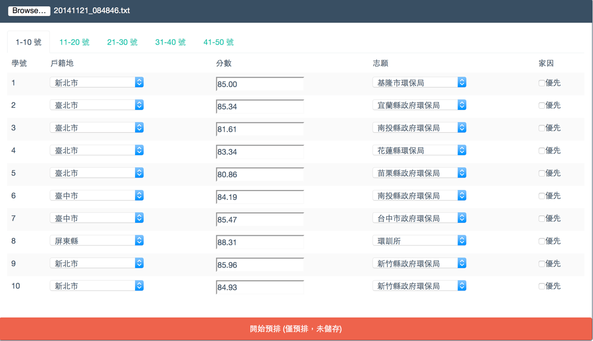
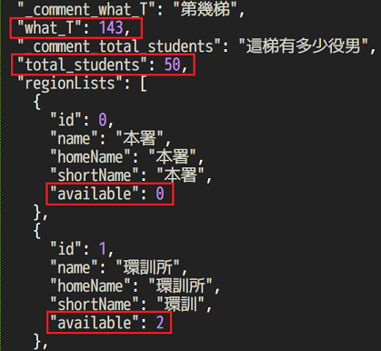
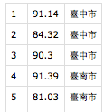
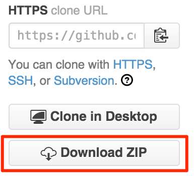
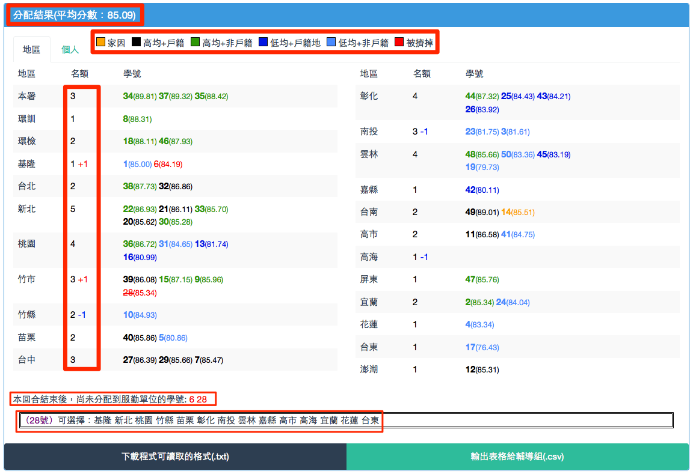

# EPA SMS Dispatcher

This is a simple system for [Environmental Protection Agency](http://www.epa.gov.tw/mp.asp) to dispatch its [Substitute Military Service](https://en.wikipedia.org/wiki/Alternative_civilian_service) personnel.

Although this system is designed for EPA, it can be easily modified to fit other departments as well.

## Demo

[Demo page (142T)](http://chunnorris.net/public/epa/index.html)

## 步驟

1. 事前準備，修改役男人數、各縣市名額等參數
2. 整理役男名單，並彙整成此系統可接受的格式
3. 開始預排
4. 儲存並列印預排之結果

## 步驟說明

### （一）修改參數

1. 依照這一梯的役男總人數修改 **region.json** 的 total_students 欄位
2. 依照這一梯各縣市的名額修改 **region.json** 的 available 欄位

### （二）外部匯入資料之格式

檔案 -> 新增 -> 空白活頁簿

除了手動輸入外，也可以從檔案直接匯入資料。
外部匯入的資料必須符合下列格式：

1. 必須是以 **UTF-8** 編碼儲存的 csv 檔案。
2. csv 表格內總共三欄，第一欄為號碼、第二欄為戶籍地、第三欄為分數。如圖片：

若需範例，請參考 *demo* 資料夾內的 csv 檔案。

**Please [make sure the input file is encoded with UTF-8 (without BOM)](http://wen198599.pixnet.net/blog/post/22314819-%5B%E5%BC%95%E7%94%A8%5Dexcel%E9%96%8B%E5%95%9Fcsv%E6%AA%94%E7%9A%84%E8%8A%B1%E5%BC%8F%E6%8A%80%E5%B7%A7)**

#### ＠微軟使用者注意事項

Microsoft Office Excel 預設是以 Big5 編碼儲存檔案，因此我們存檔時必須手動選擇 UTF-8 編碼，步驟如下：

1. 另存新檔案 -> 選擇 csv 
2. 選擇工具 -> 網路選項 
3. 選擇編碼 -> 選擇 UTF-8 編碼 
4. 儲存檔案

### （三）開始預排

1. 開啟 Firefox 瀏覽器，若尚未安裝可以[由此下載](https://mozilla.com.tw/firefox/new/)
2. 從 github 下載，解壓縮後開啟 index.html 
3. 點選左上角的瀏覽按鈕，讀取之前的 csv 或是 txt 檔案當作範例，並按下下方的開始預排

以此範例向役男講解本系統：

> 1. 平均分數
> 2. 區域名額與加減人數
> 3. 上方顏色說明（分發規則說明）
> 4. 尚未分配到的學號、點選可自動搜尋最佳落點

接著講解預排的規則、正式分發的步驟

> 1. 被點到號碼的役男請大聲說出自己的志願
> 2. 當切換到自己所屬的頁面時，請檢查自己的戶籍地與成績是否正確
> 3. 每回合結束後，會有三到五分鐘討論時間
> 4. 告知預排截止時間
> 5. 講解正式分發時的規則
> 6. 詢問是否有不懂分發規則的，或有其他疑問

接下來開始正式預排

1. 重新整理頁面，並讀取這梯的 csv 或是 txt 檔
2. 第一輪：一個一個叫號碼，選擇志願。家因優先者若戶籍地沒開缺額，可以優先選擇戶籍地周圍縣市
3. 存擋、看預排結果、討論
4. 第二輪：一到十號想修改志願的舉手，依此類推
5. 存擋、看預排結果、討論
6. 第三輪之後，想修改的直接舉手
7. 當尚未分配到的人數越來越少時，可以直接點選其號碼，系統會提示這個號碼還剩哪些地方可以選擇

請記得每次按下預排按鈕前都先存擋（txt檔），以避免突發狀況造成資料流失、影響預排時間。

預排結束後，可讓役男們拍照留念，也可截圖備份，並按下右下角輸出表格。

## 其他設定

js/global.js 內的 printRound_N 可以改變預排結果的縣市欄位中，顯示幾筆資料後才換行

    printRound_N = 3; // 每三筆資料就換行

    printRound_N = 6; // 每六筆資料才換行

js/global.js 內的 fontColors{} 可以改變不同階段錄取的顏色

使用不同顏色來代表 不同階段錄取 的役男

    fontColors = {
      type1 : "black", // 第一階段錄取（分數大於均標，戶籍地）
      type2 : "#229922", // 第二階段錄取（分數大於均標，非戶籍地）
      type3 : "#0000dd", // 第三階段錄取（分數低於均標，戶籍地）
      type4 : "#4488ff", // 第四階段錄取（分數低於均標，非戶籍地）
      // typeDefault : "black", // 預設顏色
      typeHome : "orange", // 家因顏色
      typeKicked : "red", // 選某個地區時，被擠掉的人的顏色
      leftOver : "red", // 本回合結束後，尚未分配到服勤單位的顏色
      shortage : "blue", // 地區人數短缺時的顏色
      overheat : "red" // 地區人數過多時的顏色
    };

## Note

Actually, the offilne version can save data in the browser's storage. But most employees prefer txt files.

## Todo Lists

- 臨時驗退的 ex 7號，戶籍地留下，分數變 NA，不算入平均，總人數怎麼辦
  - 如果遇到這種情形，總人數還是填 50 人，而不是 49 人
  - 在 143T_input.csv 內，一樣要把 7 號的學號，戶籍地 留下，但是在分數欄位填入 "NA"
- 台北市 跟 臺北市 到底要用哪個？？
- 增加 “全部清除” 按鈕 (F5)
- 要印給輔導組，照號碼排
- 123456789123
- 裝 firefox, notepad++, D碟不會自動回復
- Tutorial pages with screenshots
- Chrome modification.
  - https://stackoverflow.com/questions/2541949/problems-with-jquery-getjson-using-local-files-in-chrome
  - MAC: open /Applications/Google\ Chrome.app --args --allow-file-access-from-files
  - http://eureka.ykyuen.info/2013/09/24/chrome-bypass-access-control-allow-origin-on-local-file-system/

## License

This project is licensed under the terms of the [MIT license](http://opensource.org/licenses/MIT).

Please note that this project is built with materials from the following parties:

- [Bootstrap](http://getbootstrap.com/)
- [flatly](http://bootswatch.com/flatly/)
- [jQuery](https://jquery.com/)

Please also refer to their Licenses for further information.

